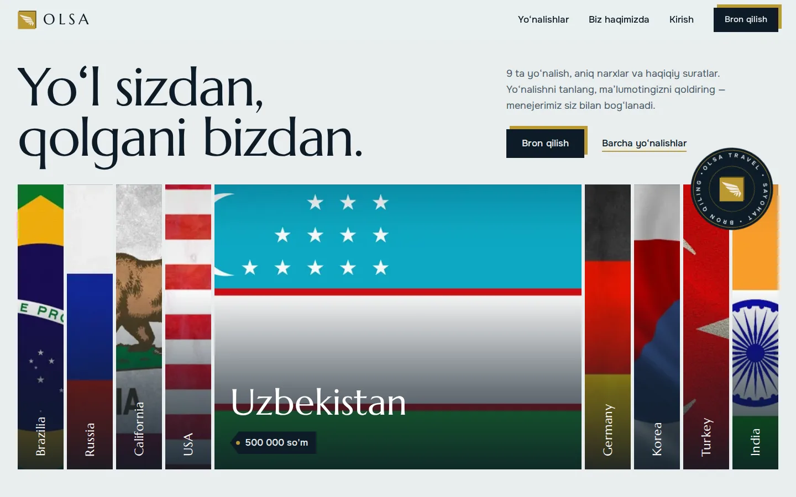
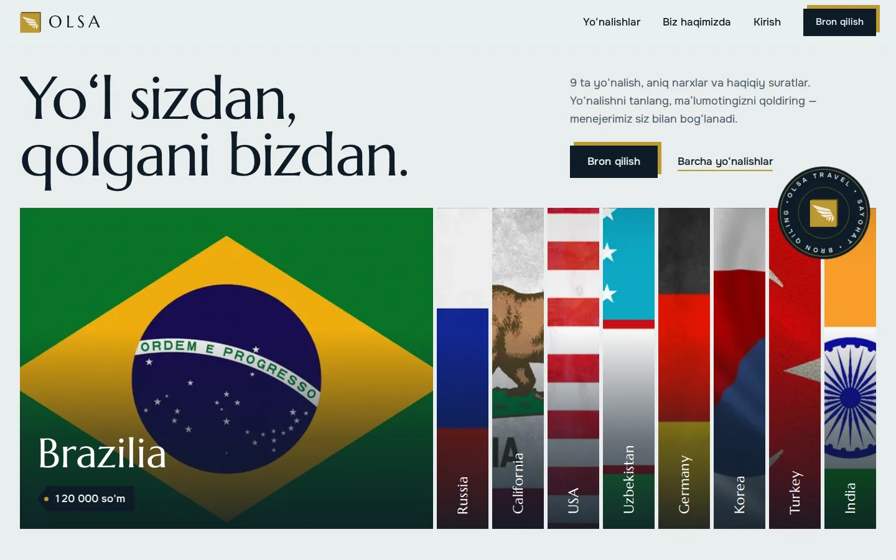
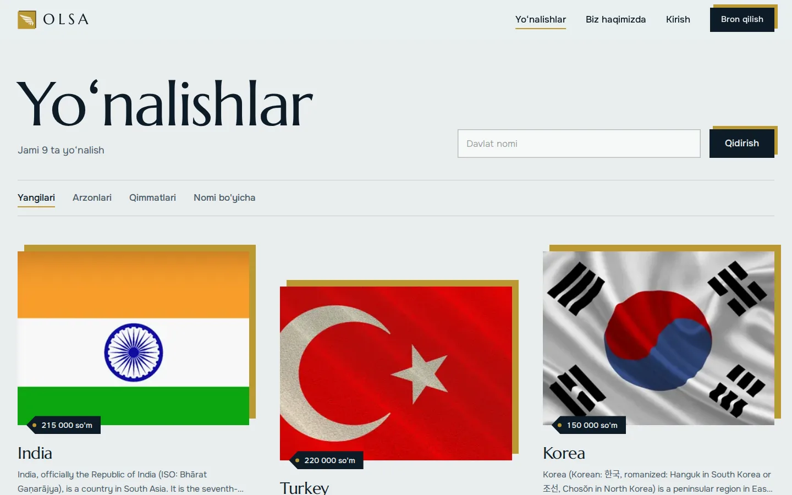
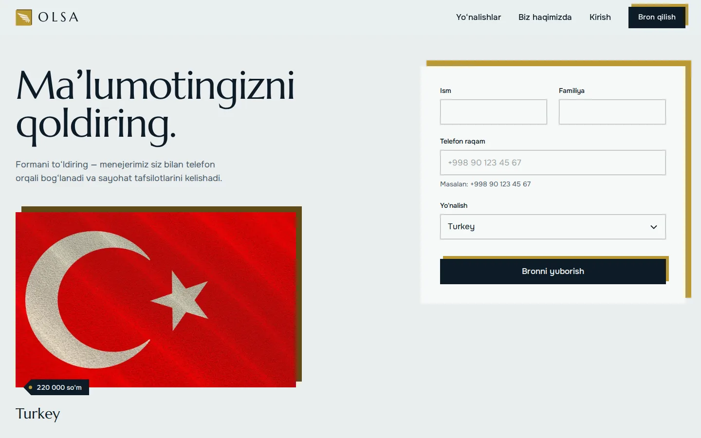
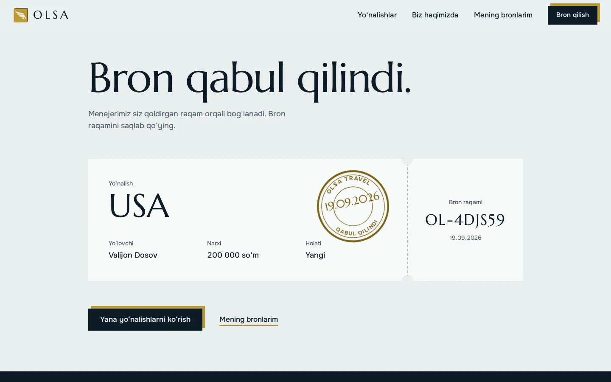
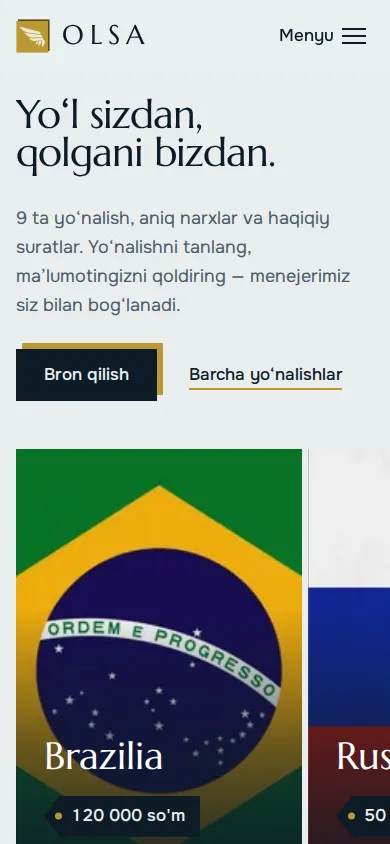
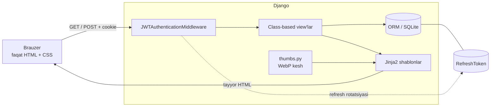
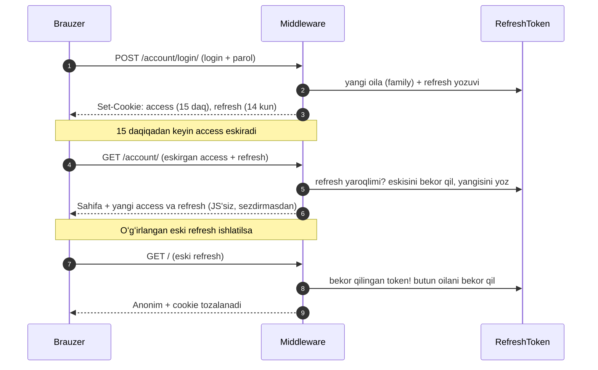
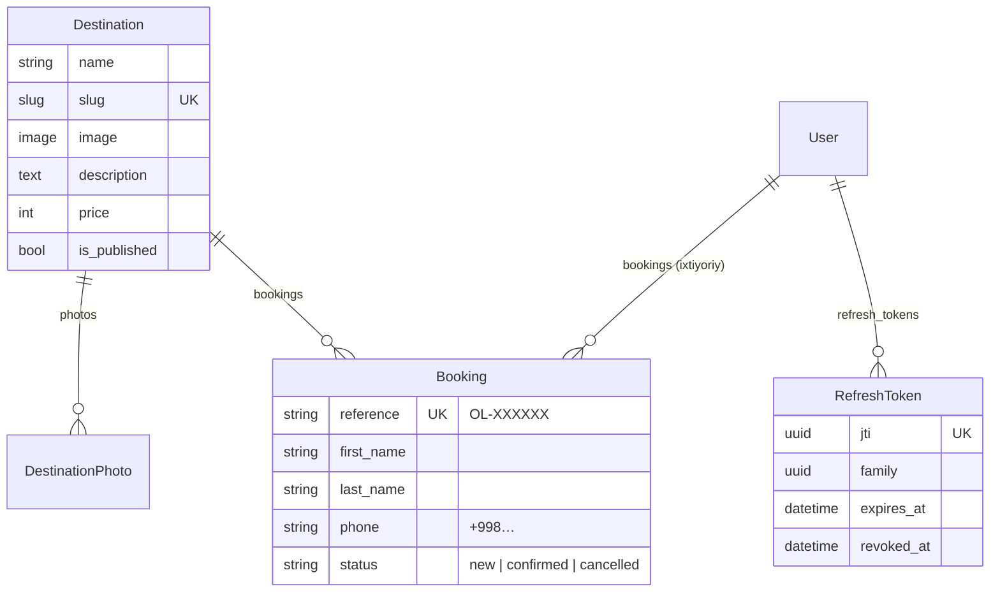

<div align="center">


# OLSA Travel

**Yoʻl sizdan, qolgani bizdan.**
Sayohat kompaniyasi uchun zamonaviy veb-sayt: yoʻnalishlar, narxlar, onlayn bron va JWT bilan himoyalangan hisoblar.




</div>

---

## Mundarija

- [Nimalar oʻzgardi](#nimalar-ozgardi)
- [Imkoniyatlar](#imkoniyatlar)
- [Skrinshotlar](#skrinshotlar)
- [Texnologiyalar](#texnologiyalar)
- [Arxitektura](#arxitektura)
- [JWT autentifikatsiya](#jwt-autentifikatsiya)
- [Tez boshlash](#tez-boshlash)
- [Sozlamalar](#sozlamalar)
- [Loyiha tuzilishi](#loyiha-tuzilishi)
- [Dizayn tizimi](#dizayn-tizimi)
- [Maʼlumotlar modeli](#malumotlar-modeli)
- [Backend samaradorligi](#backend-samaradorligi)
- [Testlar](#testlar)
- [Production](#production)
- [Xavfsizlik eslatmalari](#xavfsizlik-eslatmalari)

---

## Nimalar oʻzgardi

Loyiha noldan qayta yozildi; mavjud maʼlumotlar (yoʻnalishlar, suratlar, bronlar) migratsiya orqali **saqlab qolindi**.

| Avval | Endi |
| --- | --- |
| Swiper, inline `<script>`, `<marquee>`, Bootstrap qoldiqlari | **Brauzerga JavaScript yuborilmaydi.** Animatsiyalar CSS, navigatsiya oʻtishlari View Transitions, lightbox — HTML `popover` |
| 7 ta qoʻlda yozilgan CSS, piksellarga qattiq bogʻlangan (`width: 1435px`) | **Tailwind CSS 4** — bitta 44 KB (gzip ~10 KB) fayl, hamma ekranga moslashuvchan |
| Django shablonlari, har birida oʻz `<html>` va `<head>` | **Jinja2** — bitta `base.html`, makrolar, toza meros |
| Sessiya, autentifikatsiya yoʻq | **JWT: access + refresh** (HttpOnly cookie, rotatsiya, qayta ishlatishni aniqlash) |
| `gallery`, `select`, `CountryPictures`, `logotip` modellari | `Destination`, `DestinationPhoto`, `Booking` — toza nomlar, slug, holatlar |
| 4K (6 MB) suratlar toʻgʻridan-toʻgʻri yuklanardi | Talab boʻyicha WebP + `srcset` (~30–150 KB) |
| Lorem ipsum matnlar, `SECRET_KEY` repozitoriyda | Haqiqiy matnlar, sirlar `.env` da |

## Imkoniyatlar

**Foydalanuvchi uchun**
- Bosh sahifada yoʻnalishlar tasmasi: ustiga olib borsangiz tasma ochiladi, telefonda gorizontal aylantiriladi
- Yoʻnalishlar roʻyxati: nom boʻyicha qidiruv, narx/nom boʻyicha saralash, sahifalash
- Yoʻnalish sahifasi: toʻliq ekranli surat, tavsif, suratlar galereyasi (lightbox), boshqa yoʻnalishlar
- Onlayn bron: telefon raqam avtomatik `+998…` koʻrinishiga keltiriladi, xatolar maydon yonida chiqadi
- Bron tasdigʻi: chipta va “bosiladigan” muhr animatsiyasi, noyob bron raqami (`OL-7K3M9P`)
- Hisob: roʻyxatdan oʻtish, kirish, “Mening bronlarim”, bitta yoki barcha qurilmalardan chiqish
- Sahifalar orasida silliq oʻtish: yoʻnalish surati kartochkadan sahifa tepasigacha “uchib” boradi (Chromium/Safari)

**Administrator uchun**
- Django admin: suratlarni inline qoʻshish, `is_published` bilan yoʻnalishni yashirish, bronlar holatini bir bosishda oʻzgartirish, qidiruv va filtrlar
- `RefreshToken` jadvali admin panelida (faqat oʻqish uchun) — qaysi qurilmadan kirilganini koʻrish mumkin

## Skrinshotlar

<table>
  <tr>
    <td width="50%"><br><sub><b>Bosh sahifa</b> — sahifa ochilganda tasmalar ketma-ket paydo boʻladi</sub></td>
    <td width="50%"><br><sub><b>Yoʻnalishlar</b> — qidiruv, saralash, sahifalash</sub></td>
  </tr>
  <tr>
    <td><br><sub><b>Yoʻnalish sahifasi</b> — scroll bilan bogʻlangan parallaks</sub></td>
    <td><br><sub><b>Bron formasi</b> — tanlangan yoʻnalish oldindan toʻldirilgan</sub></td>
  </tr>
  <tr>
    <td><br><sub><b>Bron tasdigʻi</b> — muhr bosilish animatsiyasi</sub></td>
    <td align="center"><br><sub><b>Telefon</b> — tasmalar aylantiriladi</sub></td>
  </tr>
</table>

## Texnologiyalar

| Qatlam | Nima ishlatilgan | Nega |
| --- | --- | --- |
| Backend | Python 3.10+, Django 5.2 LTS | Class-based view'lar, ORM, admin |
| Shablonlar | **Jinja2** (Django `Jinja2` backend) | Tezroq va ifodali; admin Django shablonlarida qoladi |
| Frontend | **Tailwind CSS 4** (CLI), Marcellus + Onest (lokal WOFF2) | Tashqi CDN va JS yoʻq |
| Autentifikatsiya | **PyJWT**, HttpOnly cookie, bazada refresh yozuvlari | Sessiyasiz, rotatsiya bilan |
| Rasmlar | Pillow → WebP, `srcset` | Sahifa hajmi oʻnlab baravar kichik |
| Statik | WhiteNoise (production) | Alohida veb-server shart emas |
| Maʼlumotlar bazasi | SQLite (istalgan Django bazasiga almashtiriladi) | Qoʻshimcha oʻrnatish shart emas |

## Arxitektura



Frontend va backend **JavaScript orqali bogʻlanmagan**: server maʼlumotni Jinja bilan tayyor HTMLga joylaydi, formalar oddiy `POST` bilan yuboriladi, token yangilash esa middleware ichida serverda sodir boʻladi.

## JWT autentifikatsiya

| | Access token | Refresh token |
| --- | --- | --- |
| Vazifasi | Har soʻrovda kimligini tasdiqlaydi | Yangi access olish |
| Muddati | 15 daqiqa (`JWT_ACCESS_MINUTES`) | 14 kun (`JWT_REFRESH_DAYS`) |
| Saqlanishi | HttpOnly cookie `olsa_access` | HttpOnly cookie `olsa_refresh` + bazada `jti` yozuvi |
| Tekshiruv | Faqat imzo (bazaga murojaatsiz) | Imzo + baza holati |

Cookie xususiyatlari: `HttpOnly` (JavaScript oʻqiy olmaydi — XSS token oʻgʻirlay olmaydi), `SameSite=Lax`, `Secure` (production'da).



- **Rotatsiya** — har yangilashda refresh token almashadi; eskisi bekor qilinadi.
- **Qayta ishlatishni aniqlash** — allaqachon almashtirilgan token qayta kelsa, shu login sessiyasidagi (oiladagi) barcha tokenlar bekor qilinadi.
- **Poyga himoyasi** — parallel ikki soʻrov bir vaqtda yangilashga urinsa (10 soniya ichida), foydalanuvchi tizimdan chiqib ketmaydi.
- **Chiqish** — faqat `POST` (CSRF bilan): refresh oilasi bazada bekor qilinadi, cookie oʻchiriladi. “Barcha qurilmalardan chiqish” — foydalanuvchining hamma tokenlarini.
- **Brute-force himoyasi** — bir IP + login uchun 15 daqiqada 5 ta xato urinishdan keyin vaqtincha bloklanadi.
- **Admin paneli** Django sessiyasida qoladi (`/admin/`), sayt esa faqat JWT bilan ishlaydi.

Kod: [`accounts/tokens.py`](accounts/tokens.py) (yaratish/rotatsiya), [`accounts/middleware.py`](accounts/middleware.py) (har soʻrovda autentifikatsiya), [`accounts/auth.py`](accounts/auth.py) (login/logout yordamchilari).

## Tez boshlash

Talab: **Python 3.10+** va **Node.js 18+** (Node faqat CSS yigʻish uchun; tayyor `static/css/app.css` repozitoriyda bor, shuning uchun Node'siz ham ishga tushadi).

```bash
# 1. Muhit va bogʻliqliklar
python -m venv .venv
source .venv/bin/activate            # Windows: .venv\Scripts\activate
pip install -r requirements.txt

# 2. Sozlamalar
cp .env.example .env

# 3. Baza va demo maʼlumotlar (9 ta yoʻnalish, suratlar bilan)
python manage.py migrate
python manage.py loaddata demo
python manage.py createsuperuser     # admin panel uchun

# 4. Suratlarning kichik nusxalarini oldindan tayyorlash (ixtiyoriy, tezlashtiradi)
python manage.py warm_thumbnails

# 5. Ishga tushirish
python manage.py runserver
```

Sayt: <http://127.0.0.1:8000> · Admin: <http://127.0.0.1:8000/admin/>

### Dizaynni oʻzgartirish (Tailwind)

```bash
npm install
npm run dev      # kuzatuvchi: shablon yoki assets/css/input.css oʻzgarsa, CSS qayta yigʻiladi
npm run build    # minifikatsiya qilingan static/css/app.css
```

Dizayn tokenlari (ranglar, shriftlar) — [`assets/css/input.css`](assets/css/input.css) ichidagi `@theme` blokida.

## Sozlamalar

Hammasi `.env` (yoki muhit oʻzgaruvchilari) orqali:

| Oʻzgaruvchi | Standart | Izoh |
| --- | --- | --- |
| `DJANGO_DEBUG` | `1` | Production'da `0` |
| `DJANGO_SECRET_KEY` | — | Production'da **majburiy** (`DEBUG=0` boʻlsa, boʻlmasa xato beradi) |
| `DJANGO_ALLOWED_HOSTS` | `localhost,127.0.0.1` | Vergul bilan ajratiladi |
| `DJANGO_CSRF_TRUSTED_ORIGINS` | — | Masalan `https://olsa.uz` |
| `DJANGO_SSL_REDIRECT` | `1` | Faqat `DEBUG=0` da: HTTP → HTTPS |
| `JWT_SIGNING_KEY` | `SECRET_KEY` | JWT imzosi uchun alohida kalit |
| `JWT_ACCESS_MINUTES` | `15` | Access token muddati |
| `JWT_REFRESH_DAYS` | `14` | Refresh token muddati |
| `DATABASE_PATH` | `db.sqlite3` | SQLite fayl yoʻli |
| `CURRENCY_LABEL` | `so'm` | Narx yonidagi valyuta |

Maxfiy kalit yaratish:

```bash
python -c "import secrets; print(secrets.token_urlsafe(50))"
```

## Loyiha tuzilishi

```text
OLSA_TRAVEL/
├── config/                 # Django loyiha sozlamalari
│   ├── settings.py         #   .env asosidagi sozlamalar, Jinja2 + Django backendlari
│   ├── jinja.py            #   Jinja muhiti: url(), static(), thumb(), price/excerpt filtrlari
│   ├── throttle.py         #   kesh asosidagi tezlik cheklovi
│   └── urls.py
├── accounts/               # JWT autentifikatsiya
│   ├── tokens.py           #   yaratish, rotatsiya, qayta ishlatishni aniqlash
│   ├── middleware.py       #   request.user ni cookie'lardan aniqlash + avto-yangilash
│   ├── auth.py             #   login_user / logout_user, cookie yozish
│   ├── models.py           #   RefreshToken
│   ├── views.py forms.py urls.py admin.py
│   └── management/commands/prune_tokens.py
├── main/                   # Asosiy domen: yoʻnalishlar va bronlar
│   ├── models.py           #   Destination, DestinationPhoto, Booking
│   ├── views.py forms.py urls.py admin.py
│   ├── thumbs.py           #   talab boʻyicha WebP nusxalar
│   ├── fixtures/demo.json  #   demo yoʻnalishlar: `manage.py loaddata demo`
│   ├── migrations/         #   0004 — eski modellarni maʼlumotni saqlab qayta nomlaydi
│   └── management/commands/warm_thumbnails.py
├── templates/              # Jinja2 shablonlari
│   ├── base.html  _macros.html  404.html  500.html
│   ├── main/               #   home, destination_list, destination_detail, booking_*, about
│   └── accounts/           #   login, register, profile
├── assets/
│   ├── css/input.css       #   Tailwind kirish fayli: tokenlar, komponentlar, animatsiyalar
│   └── brand/              #   logotipning asl fayli
├── static/                 # app.css (yigʻilgan), fonts/, img/
├── media_files/            # Demo suratlar (cache/ — avtomatik WebP nusxalar, gitga tushmaydi)
├── docs/screenshots/
└── requirements.txt  package.json  .env.example
```

## Dizayn tizimi

Dizayn logotipdan kelib chiqadi: **oltin kvadrat va uning orqasidagi siljigan qoʻngʻir “plita”**. Shu motiv tugmalarda, rasmlarda, fokusdagi maydonlarda va muhrda takrorlanadi.

| Token | Qiymat | Qoʻllanilishi |
| --- | --- | --- |
| Tuman | `#e9eeee` | Sahifa foni — sovuq, suratlarni “koʻtaradi” |
| Siyoh | `#0d1b26` | Matn, qorongʻi bloklar |
| Oltin | `#bb9832` | Logotipdagi oltin: plita, muhr, urgʻu |
| Plita | `#5f4a17` | Logotipdagi siljigan ikkinchi kvadrat |
| Qogʻoz | `#f7f9f8` | Forma va chipta yuzasi |

- **Shriftlar:** *Marcellus* (logotipdagi klassik serif — sarlavhalar) va *Onest* (oʻqiladigan matn). Ikkalasi ham lokal WOFF2, `font-display: swap`.
- **Bosh sahifaning markazi:** yoʻnalishlar tasmasi — davlat bayroqlari kengayadigan vertikal lentalar. Sahifa ochilganda bir marta ketma-ket paydo boʻladi; qolgan harakatlar foydalanuvchi harakatiga javob (hover, fokus, bosish).
- **Harakat:** faqat CSS — `clip-path`, `flex-grow`, `@keyframes`, `animation-timeline: scroll()`, `@view-transition`, `[popover]`. `prefers-reduced-motion` yoqilgan boʻlsa, hammasi oʻchiriladi.
- **Foydalanuvchanlik:** klaviatura fokusi koʻrinadi, “asosiy mazmunga oʻtish” havolasi, kontrast ≥ 4.5:1, 320 px dan boshlab gorizontal skrollsiz.

## Maʼlumotlar modeli



## Backend samaradorligi

- **Roʻyxat sahifalari 2 ta SQL** (sanash + sahifa): uzun `description` maydoni `defer()` qilinib, kartochka uchun faqat 220 belgisi `Substr` bilan olinadi.
- **Yoʻnalish sahifasi 3 ta SQL**: `prefetch_related("photos")` — N+1 yoʻq (testlar `assertNumQueries` bilan tekshiradi).
- **Access token bazaga tegmaydi**: foydalanuvchi faqat kerak boʻlganda (lazy) yuklanadi.
- **Rasmlar**: `thumbs.py` birinchi soʻrovda `media_files/cache/<kenglik>/…webp` yaratadi; `srcset` + `loading="lazy"` + `decoding="async"`. Asl fayl tegilmaydi.
- **GZip** va (production'da) **WhiteNoise** siqilgan, versiyalangan statik fayllar.
- `PROTECT`: bronlari bor yoʻnalishni tasodifan oʻchirib boʻlmaydi.

## Testlar

```bash
python manage.py test
```

31 ta test: JWT (cookie xususiyatlari, avto-yangilash, rotatsiya, qayta ishlatishni aniqlash, poyga oynasi, soxta token, oʻchirilgan foydalanuvchi, open-redirect, brute-force), sahifalar, qidiruv/saralash, soʻrovlar soni, bron (telefon normallashtirish, tezlik cheklovi, yashirin yoʻnalish), slug va bron raqamlarining noyobligi.

## Production

```bash
DJANGO_DEBUG=0 DJANGO_SECRET_KEY=... DJANGO_ALLOWED_HOSTS=olsa.uz \
  python manage.py collectstatic --noinput

gunicorn config.wsgi:application --bind 0.0.0.0:8000 --workers 3
```

Nazorat roʻyxati:

- [ ] `DJANGO_DEBUG=0`, kuchli `DJANGO_SECRET_KEY`, toʻgʻri `ALLOWED_HOSTS` va `CSRF_TRUSTED_ORIGINS`
- [ ] HTTPS (reverse-proxy `X-Forwarded-Proto` yuborsin) — cookie'lar `Secure` boʻladi
- [ ] `media_files/` ni Nginx yoki obyekt-xotira orqali bering (Django faqat `DEBUG` da beradi)
- [ ] Bir nechta worker boʻlsa, `CACHES` ni Redis/Memcached ga almashtiring (tezlik cheklovi umumiy boʻlishi uchun)
- [ ] `db.sqlite3` gitga tushmaydi (`.gitignore`) — production'da PostgreSQL yoki alohida saqlanadigan SQLite ishlating
- [ ] Eski tokenlarni tozalash uchun cron: `python manage.py prune_tokens`
- [ ] `python manage.py check --deploy` ogohlantirishsiz (HSTS preload — ixtiyoriy)

## Xavfsizlik eslatmalari

- Access token muddati tugaguncha (standart 15 daqiqa) chiqishdan keyin ham texnik jihatdan yaroqli — bu stateless JWT ning maʼlum kelishuvi. Muddatni `JWT_ACCESS_MINUTES` bilan qisqartirish mumkin.
- Bir nechta server ishlatilsa, tezlik cheklovi uchun umumiy kesh kerak (yuqoriga qarang).
- `SECRET_KEY` avval repozitoriyga tushgan edi — **eskisini ishlatmang**, yangisini yarating.

---

<div align="center">
<sub>© OLSA Travel. Barcha huquqlar himoyalangan.</sub>
</div>
